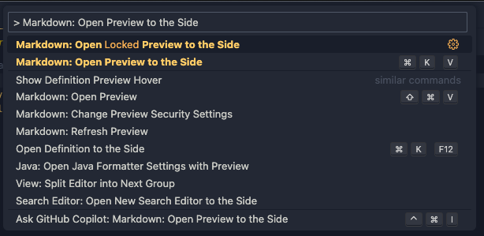
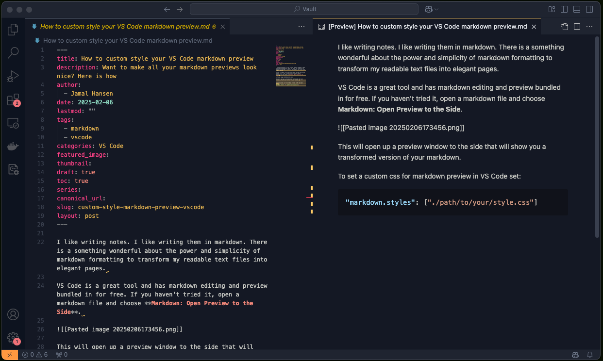
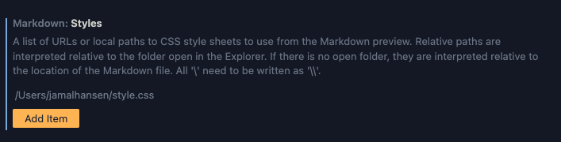

I like writing notes. I like writing them in markdown. There is something wonderful about the power and simplicity of markdown formatting to transform my readable text files into elegant pages. 

VS Code is a great tool and has markdown editing and preview bundled in for free. If you haven't tried it, open a Markdown file and choose **Markdown: Open Preview to the Side**. 



This will open up a preview window to the side that will show you a transformed version of your markdown. 



This is great! I can see what the markdown looks like and know that it's formatting my text as I wanted. But sometimes things don't work out as planned.

## Great, but not perfect
I love to copy the formatted text into emails, because it is beautifully formatted. But I use dark mode in VS Code, and when I copy out that beautifully formatted text and paste it into a document, the dark background and light text come with it. I could paste as plain text, but I would lose my formatting.

Thankfully, VS Code lets you use custom styles using our own CSS. To set this up, you just need a CSS file and to set the custom setting in your VS Code editor.

## Create your style
First, make a CSS file. Here is a very basic one for demonstration, but you can do much more.

```CSS
body {
  background-color: white;
  color: #333;
  font-family: -apple-system, BlinkMacSystemFont, 'Segoe UI', sans-serif;
  padding: 20px;
  max-width: 800px;
  margin: 0 auto;
}

h1, h2, h3 {
  color: #111;
}

code {
  background-color: #f5f5f5;
  padding: 2px 6px;
  border-radius: 3px;
}

pre {
  background-color: #f5f5f5;
  padding: 16px;
  overflow-x: auto;
}
```

Save this file somewhere accessible. I keep mine at `~/.vscode/markdown-preview.css` or the root of my project. Remember where you saved it for the next step. 

## Update User Settings
Now we need to tell VS Code to use the styling for the markdown preview. We can do that in our user settings. Choose _Preferences: Open User Settings (JSON)_ in the command palette. 

I prefer to use the JSON version of user settings, so I just add a comma to the last setting, hit enter, and then add my new setting. Don't forget to save!

```json
"markdown.styles": ["./path/to/your/style.css"]
```

If you prefer to use the User Settings UI, you can use **Preferences: Open User Settings (UI)** and find Markdown:styles and add the file there. 



_Path gotcha: In Open Folder mode, VS Code expects the path relative to your workspace root, not your home directory. If the styles aren't applying, check your path._

The preview should update automatically. If it doesn't, close and reopen it with _Markdown: Open Preview to the Side_ again.

Now you can see that the CSS has been applied to the preview. Happy note-taking!

