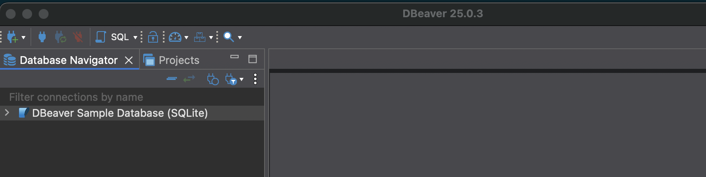
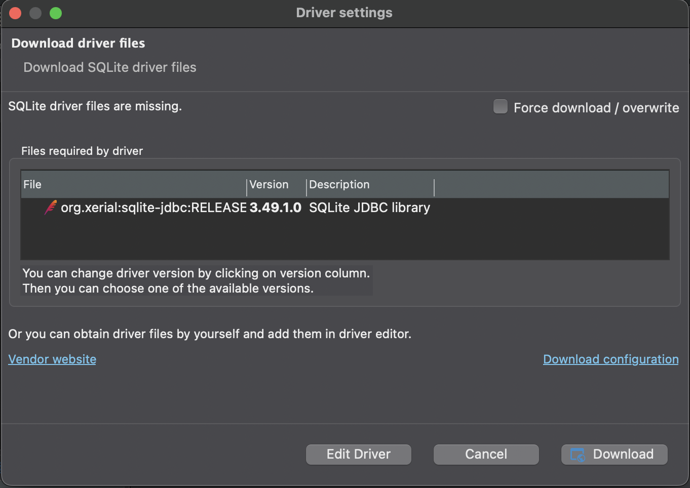
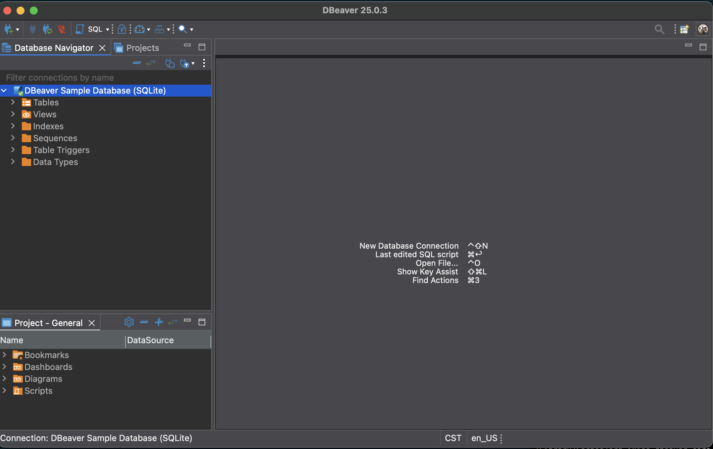
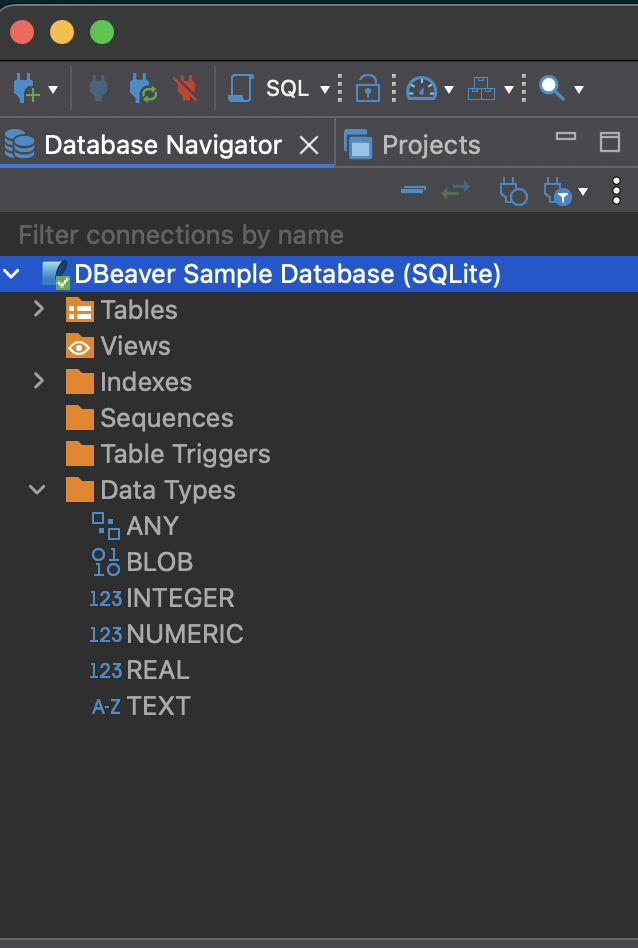
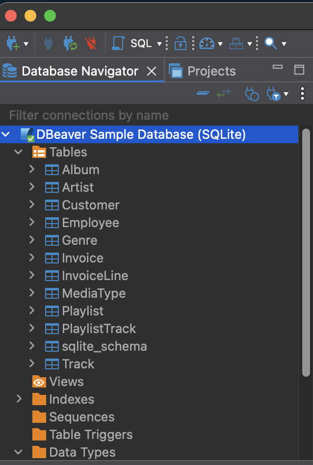
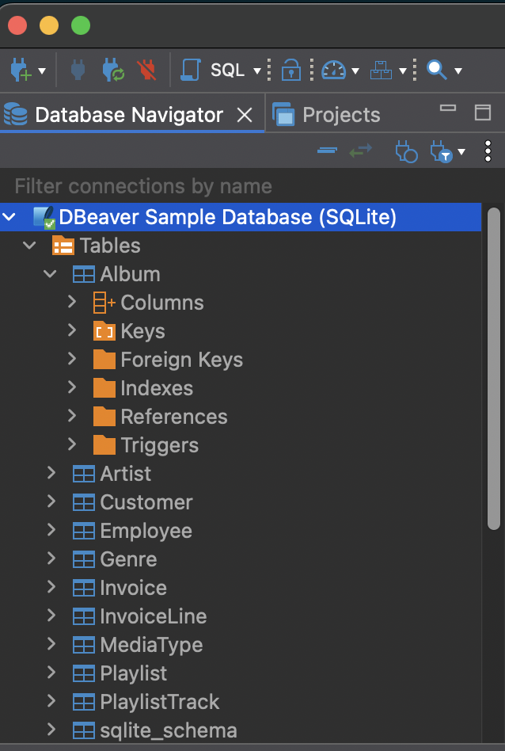
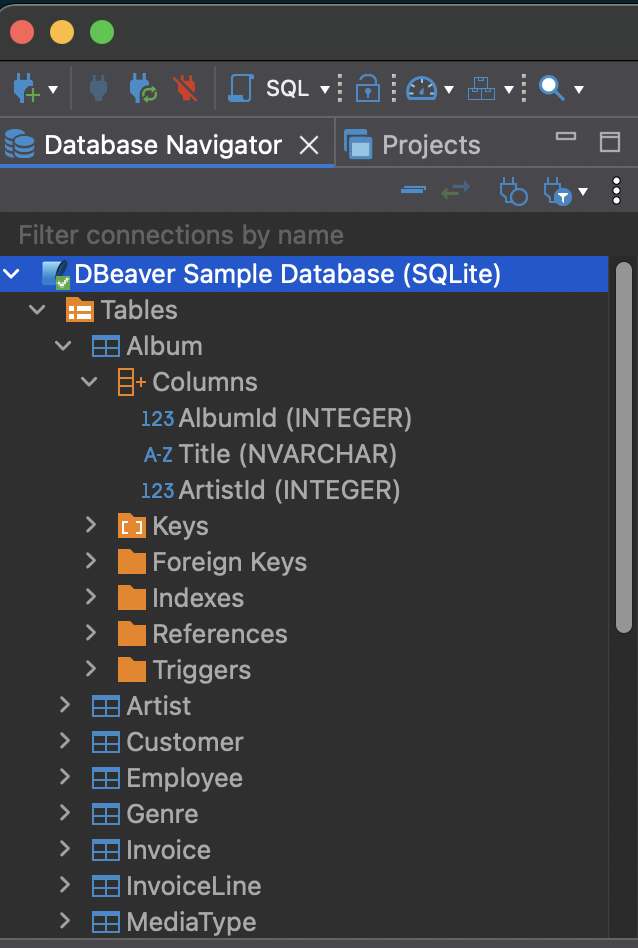

In the previous post, we installed dBeaver and created a sample database. Now let's explore what's inside.

Installing dBeaver allows you to generate a sample database. This is nice because it lets you work with data right away.

To work with the sample database you will need to install SQLite drivers.

Once the drivers are installed, you can see the tables and other attributes of the database.

Selecting data types you can see the datatypes available: any, blob, integer, numeric, real, and text.

If you click on `> Tables` you will expand the available tables.

Each table contains columns and other attributes that you can view when you expand by clicking the table name.

Finally, by clicking on Columns, you can see the columns of a table along with the associated datatype.

Now that we know what's in the sample database, we're ready to start writing some queries. That's what we'll cover in the next post.
