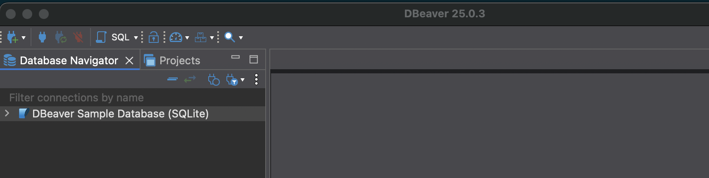
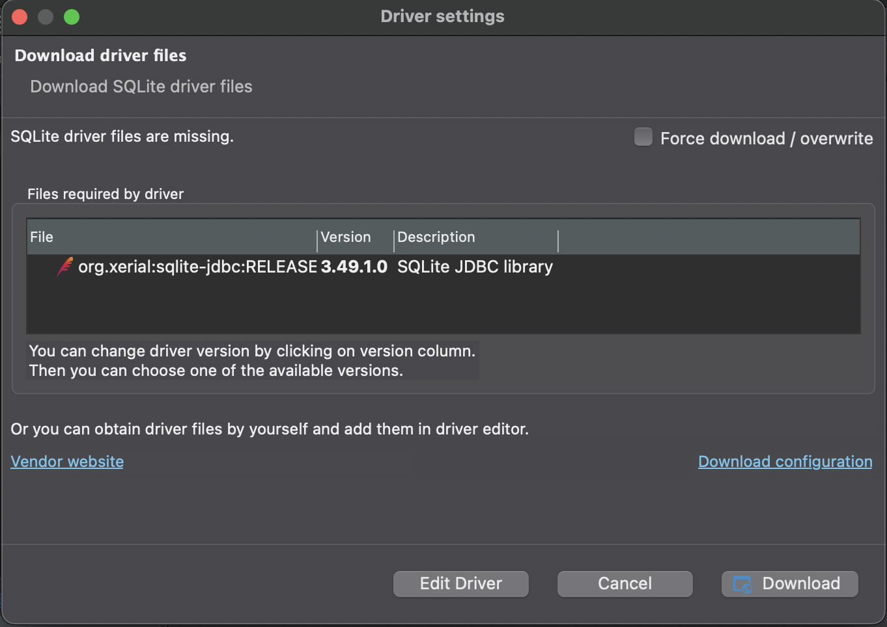
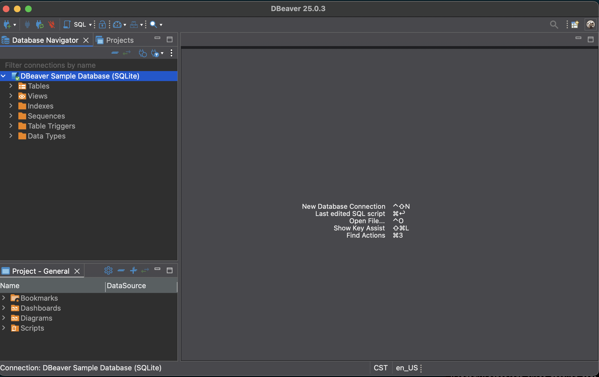
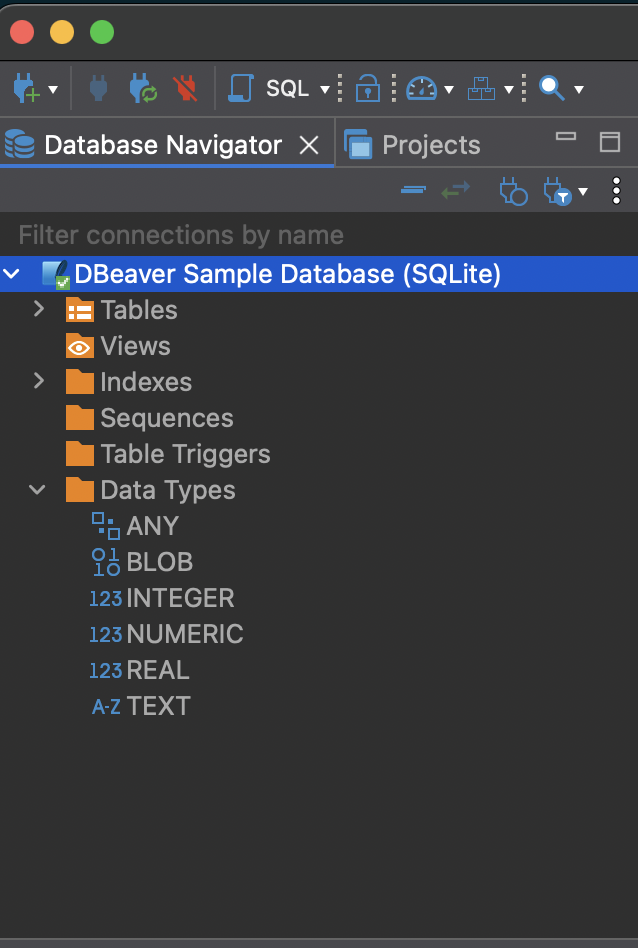
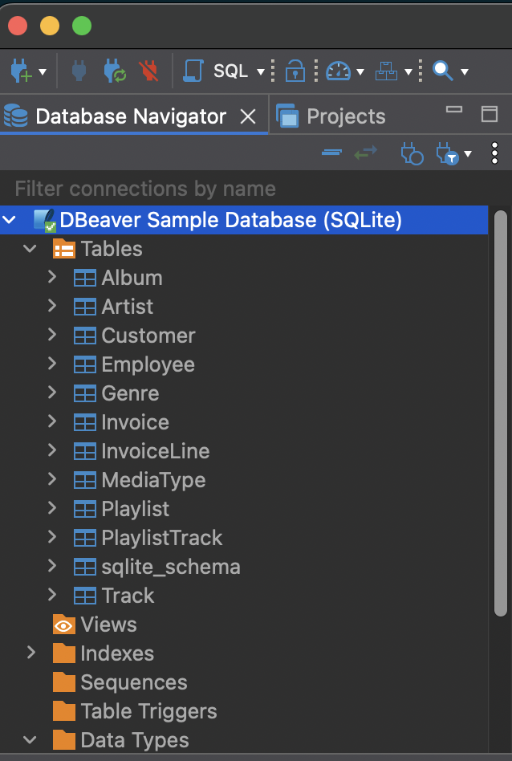
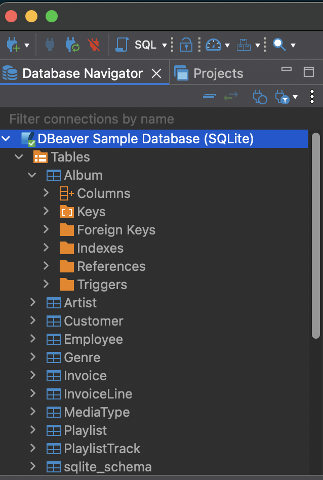
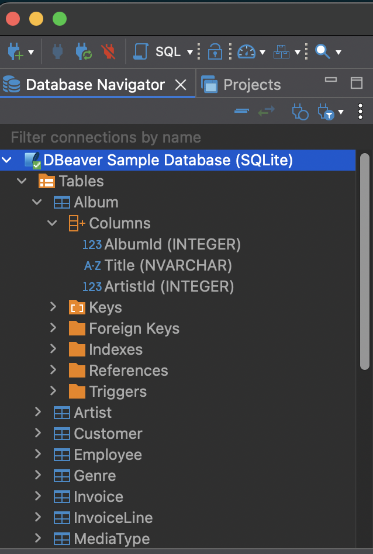

When you install DBeaver, it offers to create a sample database for you. This is worth doing -- it gives you real tables with real relationships to query against, without needing to find or import your own data.

This post walks through what's in the sample database, how to connect to it, and the first queries worth running.

## What is the DBeaver sample database?

The sample database is a SQLite database that DBeaver generates locally on your machine. SQLite stores the entire database in a single file, so there's nothing to configure or connect to remotely -- DBeaver handles it all.

The database models a small business: customers, employees, invoices, products, and the relationships between them. It's the kind of schema you'd see in a real application, which makes it useful for practicing joins, filters, aggregations, and window functions on data that actually makes sense.

## How to create and connect to the sample database

When you first open DBeaver, it will prompt you to create a sample database. If you skipped that step, you can create it manually:

1. Go to **Help > Create Sample Database**
2. DBeaver will generate a SQLite file and add a connection to your Database Navigator
3. You may need to install SQLite drivers -- DBeaver will prompt you to download them automatically

Once connected, you should see the database appear in the left-hand panel with a `> Tables` node you can expand.



## Installing the SQLite drivers

If DBeaver asks you to install drivers before connecting, click **Download** when prompted. The process is automatic.



After the drivers install, the connection will open and you can see the full database structure.

## What tables are in the sample database?



The sample database includes tables covering the core entities of a small business:

- **Employee** -- staff records with names, titles, and reporting relationships
- **Customer** -- customer contact information and assigned support rep
- **Invoice** and **InvoiceLine** -- purchase records with line items
- **Track**, **Album**, **Artist** -- a music catalog used as the product inventory
- **Genre** and **MediaType** -- lookup tables for classifying tracks
- **Playlist** and **PlaylistTrack** -- curated track collections

This is the [Chinook database](https://github.com/lerocha/chinook-database), a widely used sample dataset. Because it's well-known, you'll find plenty of example queries online if you want to go further.

## Exploring table structure

Click any table name in the navigator to open it. You can view:

- **Columns** -- names and data types for every field
- **Data** -- a preview of actual rows in the table
- **ER Diagram** -- a visual map of how tables connect





To see the columns list for a specific table, expand the table node and click **Columns**.





## First queries to run

Open a SQL editor with **SQL Editor > Open SQL Editor** (or `F3`), make sure the sample database is selected, and try these:

**See all customers:**

<!-- test:skip -->
```sql
SELECT * FROM Customer LIMIT 10;
```

**Count tracks by genre:**

<!-- test:skip -->
```sql
SELECT g.Name AS Genre, COUNT(t.TrackId) AS TrackCount
FROM Genre g
JOIN Track t ON g.GenreId = t.GenreId
GROUP BY g.Name
ORDER BY TrackCount DESC;
```

**Find the top 5 customers by total spend:**

<!-- test:skip -->
```sql
SELECT c.FirstName, c.LastName, SUM(i.Total) AS TotalSpent
FROM Customer c
JOIN Invoice i ON c.CustomerId = i.CustomerId
GROUP BY c.CustomerId
ORDER BY TotalSpent DESC
LIMIT 5;
```

**See which employees support the most customers:**

<!-- test:skip -->
```sql
SELECT e.FirstName, e.LastName, COUNT(c.CustomerId) AS CustomerCount
FROM Employee e
JOIN Customer c ON e.EmployeeId = c.SupportRepId
GROUP BY e.EmployeeId
ORDER BY CustomerCount DESC;
```

These examples cover the most common SQL operations -- filtering, joining, grouping, and sorting. The Chinook schema is well-suited for practicing all of them.

## Next steps

Now that you can see and query the sample data, the next step is writing your own queries from scratch. If you're learning SQL as a Python developer, the [SQL for Python Developers series](/series/sql-for-python-developers/) covers each concept with Python comparisons so the mental model translates.
