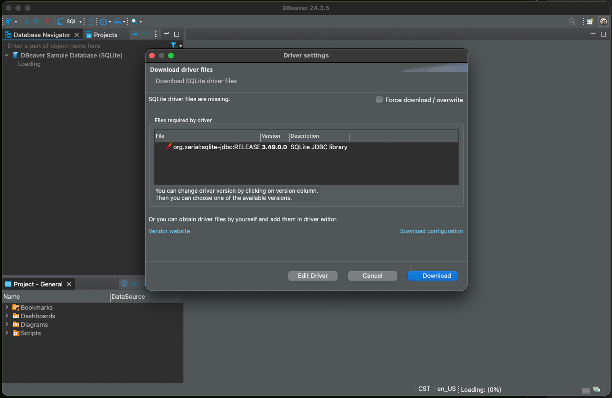
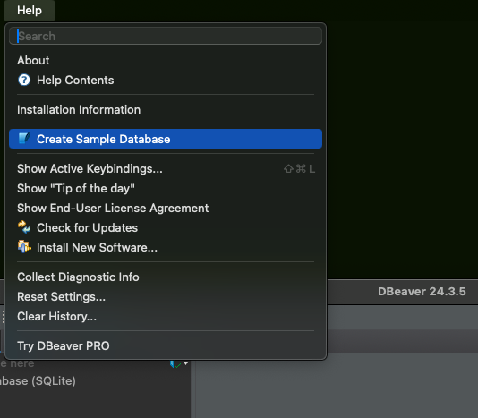

Today, I downloaded a community copy of dBeaver and installed it. Well technically I did this a while back, but today I opened it for the first time. I've been meaning to write about sql and relational databases for a while now. Some sort of beginner posts to help get people started. I've even started doing it once or twice, but it has fizzled out for all the typical reasons: 

- Life got busy
- Lost interest
- Tried to be too ambitious right off the bat 

This post is not about my past failures, it is about me downloading and installing dBeaver to begin a series of posts on learning SQL. 

## But what is dBeaver?
dBeaver is an open source database management tool that supports wide variety of databases. It allows you to interact with databases from the comfort of a nice clean interface. In a way you can think of it as VS Code for databases rather than coding. 

I installed it on my Mac using brew:

```bash
brew install --cask dbeaver-community
```

You can also [visit their downloads page](https://dbeaver.io/download/) to see how to install it on your system.

Installation was simple and today it asked me if I would like to update dBeaver to the latest version when I opened it for the first time. Like I said, it had been a while since I downloaded it. 

## Sample Database
One thing that I enjoyed about opening dBeaver is that when I opened it for the first time it asked if I wanted to create a sample database. I accepted this option and it made the SQLite database and prompted me to download the appropriate drivers. 


This is a nice onboarding experience because in the past, I would try out a database and get it installed and it's all shiny and ready to go. But it's empty, null, devoid of any data. This is a challenge when showing people about databases because I think that the best place to start is with querying data. This is something that most people will want to do, so it's a good place to begin. With an empty database, you have to go through setting up a database, or at least a table, and this level up the difficulty for beginners.

If you have dBeaver installed and would like to re-install the sample database you can find it under the help menu.

