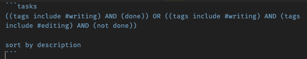
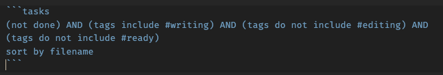
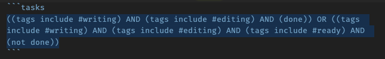

I've committed to writing three blog posts a week and, to support this, I've been logging my ideas for posts in Obsidian. I've got the [Tasks plugin](https://publish.obsidian.md/tasks/Introduction) installed, so I've set up a little system that is loosely based on the [Jeff Goins three bucket writing system](https://goinswriter.com/three-buckets/).

To facilitate this, I've added a section to my daily note under a header called **Writing**. This doesn't mean that I come up with ideas every day, but I want to have a spot where it's easy to record the ideas when I get them and also remind myself to capture ideas when I'm in the daily note.

When I have an idea, I go to the daily note and add it as a task with the #writing tag. This looks something like this:

```markdown
## Writing
- [ ] [[This is my great idea for a post]] #writing 
- [ ] [[This is an even better idea for a post]] #writing 
```

Notice that I make the idea a link to a new file. This reduces the friction from idea to actually writing since it only takes a click. It also gives me a great place to leave notes about an idea to kick start the process when it's time to write.

Because these are set up as tasks, I can use the Tasks plugin to query them. I have three queries set up on their own pages:

- Writing Prompts
- Writing Ready to Edit
- Writing Ready to Post

For each of these I have written a query that will return posts that meet that criteria, so when it's time to do each task, I have a list of posts to work on.

## Writing Prompts

This is the one that I've gotten the most mileage out of so far since my goal is to write the initial draft, not to edit or post them.

This is the query I use for the unwritten writing prompts. It looks for posts that have the #writing tag, but do not have the #editing tag. It also sorts them based on the file where they are found. Since they are put into the daily notes, this will roughly put the oldest first.



## Ready to Edit

Once the draft is done, I need to edit and clean it up, maybe add some pictures or formatting. The query for this is:



## Ready to Post

Once I've gotten the fully edited post it can go on the ready to post list. This will be finished work, ready to be transferred to the blog or posted later.



You will notice that I have some extra logic in these to handle tasks marked completed. They will move to the next phase, but will not fall out of the pipeline. If I see a completed task in the next bucket, I can just uncheck it and add the proper tag.

## Workflow

With these in place the workflow looks something like this:

- Idea! - add task to daily note with #writing tag
- Draft - write and add #editing when done
- Edit - edit then add #ready when done
- Ready to post - check when done

I hope that you find this helpful and happy writing!
